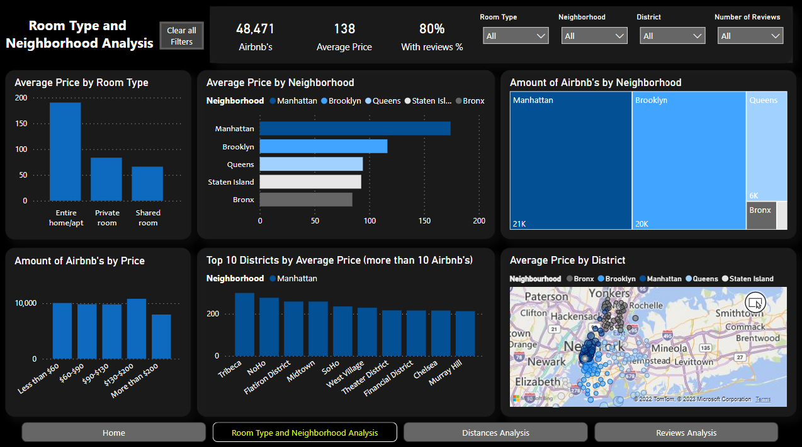
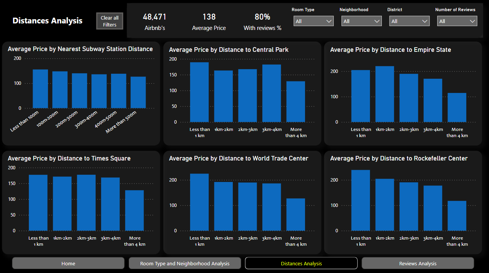
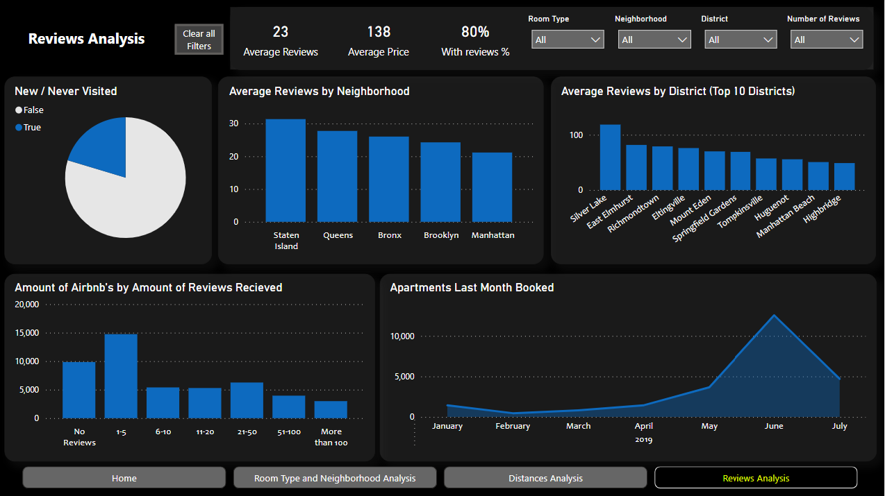

# New-York-AIRBNB-s-Report

### Project Goal:
The idea of the project is to analize information about NYC Airbnb's obtaining important insights about prices, reviews, difference by neighborhood, difference by their location, among others.

### Data acquisition:
- NYC Airbnb's information was obtained by a kaggle dataset (https://www.kaggle.com/datasets/dgomonov/new-york-city-airbnb-open-data).
- NYC subway stations geolocation was also obtained by a kaggle dataset (https://www.kaggle.com/datasets/new-york-state/nys-nyc-transit-subway-entrance-and-exit-data)

### Data Wrangling:
Both datasets were load in python and wrangled using pandas library.

First, I created the price - grouped column and reviews - grouped column from the price and reviews columns respectively. 

Then, I collected information about the 12 most iconic NYC attraction. I created a new column for each attraction with the distance between the AIRBNB and the attraction.

The next step was to work with the subway stations information. I used the BallTree algorithm from the sklearn library which uses the haversine method to calculate the distances using geolocation. 

The final step was to drop the rows that contained outliers in the price column because they were making noise to the report.

### Power Bi
Next, I loaded the final dataset in power bi and add some other columns and created some new tables that helped me in developing the report.

### Insights
Many insights can be taken from the report. I am going to highlight some of them:

### __Room Type and Neighborhood Analysis__

- We can see that, as one can imagine, entire apartments almost double the price of the Private Room and are three times more expensive than Shared Rooms.
- The Airbnb's in Manhattan are on average the most expensive ones, being Tribeca, Noho and Flatiron district the top 3 most expensive districts in New York.
- As well, we can see that around 85% of the options available are in Manhattan and Brooklyn.

### __Distances Analysis__

- The variable "distance to subway station" impacts on the price of the Airbnb. The ones closer to stations are a bit more expensive.
- Also, distances to some of the most important attractions are relevant to the prices. Examples of that are the distances to attractions such as Central Park, Empire State, Times Square, World Trade Center and Rockefeller Center. The Airbnb tends to be a bit more expensive the closer it is to those attractions.

### __Reviews Analysis__

- 80 % of the Airbnb's in NYC have been booked at least once.
- The most of the Airbnb's have been booked between 1 and 5 times.
- The most of the Airbnb's have been last visited in June, making sense as it is the peak of the summer season.

These are just a few insights that can be taken. Many more can be observed through analyzing the report deeper :)

